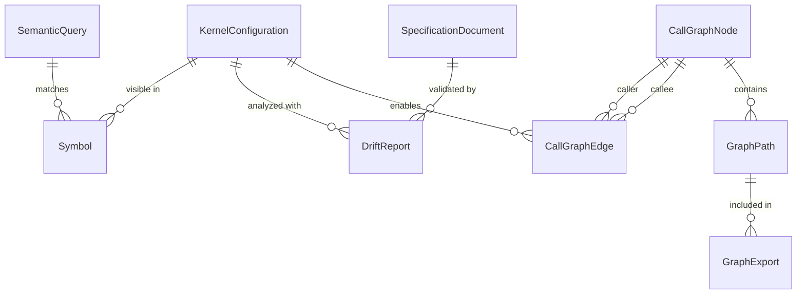

# Data Model Specification

**Feature**: Infrastructure Core Components Implementation
**Date**: 2025-09-17
**Source**: Feature specification entities and research findings

## Entity Definitions

### 1. KernelConfiguration

Represents platform-specific build settings and enabled features for a kernel build.

**Fields**:

- `config_name`: `String` - Configuration identifier (e.g., "x86_64:defconfig")
- `architecture`: `Enum` - Target architecture (x86, x86_64, arm64, riscv, powerpc)
- `config_type`: `Enum` - Configuration type (defconfig, allmodconfig, custom)
- `enabled_features`: `Set<String>` - CONFIG_* options that are enabled
- `disabled_features`: `Set<String>` - CONFIG_* options explicitly disabled
- `module_features`: `Set<String>` - CONFIG_* options built as modules
- `dependencies`: `Map<String, Vec<String>>` - Feature dependency graph
- `kernel_version`: `String` - Kernel version this config applies to
- `created_at`: Timestamp - When configuration was parsed
- `metadata`: JSONB - Additional architecture-specific settings

**Validation Rules**:

- config_name must be unique per kernel_version
- architecture must be valid Linux architecture
- Features must follow CONFIG_* naming convention
- Dependencies must not have cycles

**State Transitions**:

- Created → Active (when successfully parsed)
- Active → Deprecated (when kernel version changes)
- Active → Invalid (when parsing errors detected)

### 2. SpecificationDocument

Contains formal or informal descriptions of expected kernel behavior.

**Fields**:

- `spec_id`: UUID - Unique identifier
- `name`: String - Specification name
- `version`: String - Spec version
- `type`: Enum - Specification type (api, behavior, interface, constraint)
- `content`: Text - Raw specification content
- `parsed_requirements`: `Vec<Requirement>` - Extracted requirements
- `kernel_versions`: `Vec<String>` - Applicable kernel versions
- `created_at`: Timestamp
- `updated_at`: Timestamp
- `metadata`: JSONB - Additional spec metadata

**Validation Rules**:

- Name and version combination must be unique
- Content must not be empty
- At least one requirement must be extractable
- Version must follow semantic versioning

### 3. DriftReport

Represents detected differences between specification and implementation.

**Fields**:

- `report_id`: UUID - Unique identifier
- `spec_id`: UUID - Reference to SpecificationDocument
- `commit_sha`: String - Kernel commit analyzed
- `config_name`: String - Configuration used for analysis
- `total_requirements`: Integer - Number of requirements checked
- `violations`: `Vec<Violation>` - Detected violations
- `conformances`: `Vec<Conformance>` - Confirmed conformances
- `unknown`: `Vec<Unknown>` - Requirements that couldn't be verified
- `severity`: Enum - Overall severity (critical, major, minor, info)
- `generated_at`: Timestamp
- `metadata`: JSONB - Additional analysis metadata

**Nested Type - Violation**:

- `requirement_id`: String - Requirement that was violated
- `description`: Text - What was expected
- `actual_behavior`: Text - What was found
- `location`: Span - File:line:sha where violation found
- `severity`: Enum - Violation severity
- `suggested_fix`: `Optional<Text>` - Remediation suggestion

**Validation Rules**:

- Must reference valid spec_id
- Commit SHA must be valid git hash
- Sum of violations + conformances + unknown must equal total_requirements
- Severity must be justified by violation severities

### 4. SemanticQuery

A search request with semantic understanding beyond keywords.

**Fields**:

- `query_id`: UUID - Unique identifier
- `query_text`: String - Original query text
- `query_type`: Enum - Type of query (concept, similar_to, explains, implements)
- `query_embedding`: Vector(768) - Embedding representation
- `kernel_context`: `Optional<String>` - Specific kernel subsystem/area
- `config_filter`: `Optional<String>` - Configuration to filter by
- `timestamp`: Timestamp
- `metadata`: JSONB - Additional query context

**Validation Rules**:

- Query text must not be empty
- Embedding dimension must be 768 (for ada-002 compatibility)
- Config filter must reference valid configuration if provided

### 5. CallGraphNode

Represents a function in the call graph.

**Fields**:

- `node_id`: String - Unique identifier (function_name:file_path:line)
- `function_name`: String - Function name
- `file_path`: String - Source file containing function
- `line_number`: Integer - Line where function defined
- `signature`: String - Full function signature
- `is_entry_point`: Boolean - Whether this is a kernel entry point
- `entry_type`: `Optional<Enum>` - Type if entry point (syscall, ioctl, file_ops, sysfs)
- `config_visibility`: `Vec<String>` - Configs where this function exists
- `metadata`: JSONB - Additional function metadata

**Validation Rules**:

- node_id must be unique
- file_path must be relative to kernel root
- line_number must be positive
- entry_type required if is_entry_point is true

### 6. CallGraphEdge

Represents a function call relationship.

**Fields**:

- `edge_id`: UUID - Unique identifier
- `caller_id`: String - Reference to CallGraphNode
- `callee_id`: String - Reference to CallGraphNode
- `call_type`: Enum - Type of call (direct, indirect, macro, inline)
- `call_site`: Span - Location of the call
- `is_conditional`: Boolean - Whether call is conditional
- `config_dependent`: `Optional<String>` - CONFIG option controlling this edge
- `metadata`: JSONB - Additional edge metadata

**Validation Rules**:

- caller_id and callee_id must reference valid nodes
- Cannot have self-loops unless explicitly marked as recursive
- call_site must be within caller's function body

### 7. GraphPath

A traversal path through the call graph.

**Fields**:

- `path_id`: UUID - Unique identifier
- `source_node`: String - Starting node ID
- `target_node`: String - Ending node ID
- `path_nodes`: `Vec<String>` - Ordered list of node IDs in path
- `path_edges`: `Vec<UUID>` - Ordered list of edge IDs traversed
- `total_depth`: Integer - Number of hops in path
- `has_cycles`: Boolean - Whether path contains cycles
- `cycle_nodes`: `Optional<Vec<String>>` - Nodes involved in cycles
- `config_compatibility`: `Vec<String>` - Configs where full path exists
- `metadata`: JSONB - Path metadata (weights, metrics)

**Validation Rules**:

- path_nodes must start with source_node and end with target_node
- path_edges length must be path_nodes length - 1
- total_depth must match path_edges length
- If has_cycles is true, cycle_nodes must be populated

### 8. GraphExport

Serialized graph data for external consumption.

**Fields**:

- `export_id`: UUID - Unique identifier
- `format`: Enum - Export format (json_graph, graphml, dot, gexf)
- `scope`: Enum - Export scope (full, subgraph, paths_only)
- `node_count`: Integer - Number of nodes in export
- `edge_count`: Integer - Number of edges in export
- `file_size_bytes`: Integer - Size of serialized data
- `chunk_count`: Integer - Number of chunks if split
- `compression`: `Optional<Enum>` - Compression used (none, gzip, brotli)
- `created_at`: Timestamp
- `metadata`: JSONB - Export parameters and options

**Validation Rules**:

- file_size_bytes must be under 1GB for jq compatibility
- chunk_count > 1 only if file would exceed size limit
- format must match actual serialization format

## Database Schema Changes

### New Tables

```sql
-- Kernel configuration table
CREATE TABLE kernel_config (
    config_name VARCHAR(255) PRIMARY KEY,
    architecture VARCHAR(50) NOT NULL,
    config_type VARCHAR(50) NOT NULL,
    enabled_features JSONB NOT NULL,
    disabled_features JSONB NOT NULL,
    module_features JSONB NOT NULL,
    dependencies JSONB NOT NULL,
    kernel_version VARCHAR(50) NOT NULL,
    created_at TIMESTAMP DEFAULT NOW(),
    metadata JSONB DEFAULT '{}'
);

-- Specification documents
CREATE TABLE specification (
    spec_id UUID PRIMARY KEY DEFAULT gen_random_uuid(),
    name VARCHAR(255) NOT NULL,
    version VARCHAR(50) NOT NULL,
    type VARCHAR(50) NOT NULL,
    content TEXT NOT NULL,
    parsed_requirements JSONB NOT NULL,
    kernel_versions JSONB NOT NULL,
    created_at TIMESTAMP DEFAULT NOW(),
    updated_at TIMESTAMP DEFAULT NOW(),
    metadata JSONB DEFAULT '{}',
    UNIQUE(name, version)
);

-- Drift analysis reports
CREATE TABLE drift_report (
    report_id UUID PRIMARY KEY DEFAULT gen_random_uuid(),
    spec_id UUID REFERENCES specification(spec_id),
    commit_sha VARCHAR(40) NOT NULL,
    config_name VARCHAR(255) REFERENCES kernel_config(config_name),
    total_requirements INTEGER NOT NULL,
    violations JSONB NOT NULL,
    conformances JSONB NOT NULL,
    unknown JSONB NOT NULL,
    severity VARCHAR(20) NOT NULL,
    generated_at TIMESTAMP DEFAULT NOW(),
    metadata JSONB DEFAULT '{}'
);

-- Semantic search queries (for analytics/improvement)
CREATE TABLE semantic_query_log (
    query_id UUID PRIMARY KEY DEFAULT gen_random_uuid(),
    query_text TEXT NOT NULL,
    query_type VARCHAR(50) NOT NULL,
    query_embedding VECTOR(768),
    kernel_context VARCHAR(255),
    config_filter VARCHAR(255),
    timestamp TIMESTAMP DEFAULT NOW(),
    metadata JSONB DEFAULT '{}'
);

-- Graph export records
CREATE TABLE graph_export (
    export_id UUID PRIMARY KEY DEFAULT gen_random_uuid(),
    format VARCHAR(20) NOT NULL,
    scope VARCHAR(20) NOT NULL,
    node_count INTEGER NOT NULL,
    edge_count INTEGER NOT NULL,
    file_size_bytes BIGINT NOT NULL,
    chunk_count INTEGER DEFAULT 1,
    compression VARCHAR(20),
    created_at TIMESTAMP DEFAULT NOW(),
    metadata JSONB DEFAULT '{}'
);
```

### Modified Tables

```sql
-- Add config awareness to existing tables
ALTER TABLE symbol ADD COLUMN config_visibility JSONB DEFAULT '["x86_64:defconfig"]';
ALTER TABLE entry_point ADD COLUMN config_dependent VARCHAR(255);
ALTER TABLE call_edge ADD COLUMN config_dependent VARCHAR(255);

-- Add embedding support index
CREATE INDEX idx_semantic_query_embedding ON semantic_query_log
    USING hnsw (query_embedding vector_cosine_ops);
```

## Relationships



## Access Patterns

### High-Frequency Queries

1. Find symbols by config: Index on config_visibility
2. Traverse call graph: Index on caller_id, callee_id
3. Semantic search: HNSW index on embeddings
4. Drift by spec: Index on spec_id, commit_sha

### Write Patterns

1. Bulk insert during indexing: Use COPY for symbols
2. Incremental drift reports: Append-only pattern
3. Graph exports: Async generation with progress tracking

## Migration Safety

All changes are additive:

- New tables don't affect existing functionality
- Column additions have defaults for existing rows
- Indexes added without blocking operations
- No foreign key constraints to existing tables that could fail
