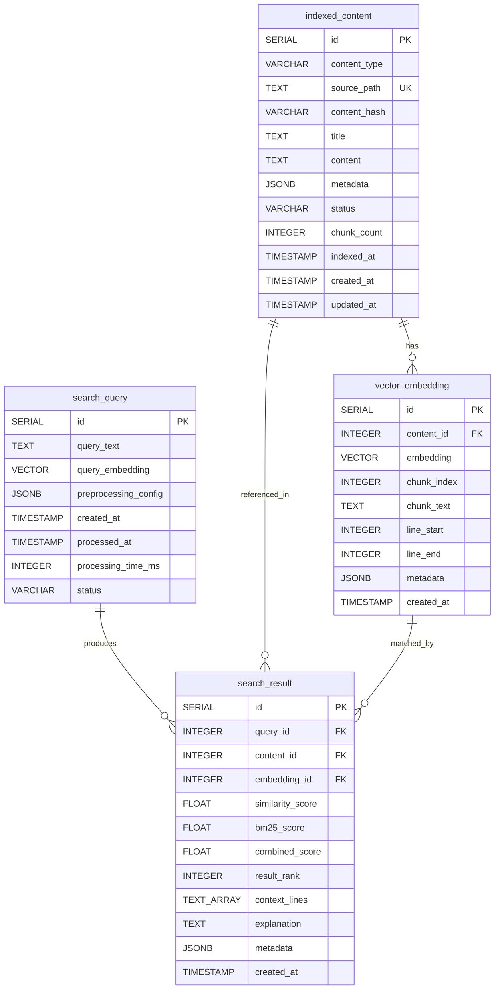

# Data Model: VectorStore System

**Generated**: 2025-09-25
**Source**: Migration 014_semantic_search_core.sql (Production Schema)

## Entity Relationship Overview



## Entity Details

### indexed_content

**Purpose**: Stores metadata about content indexed for semantic search

| Field | Type | Constraints | Description |
|-------|------|------------|-------------|
| id | SERIAL | PRIMARY KEY | Auto-incrementing identifier |
| content_type | VARCHAR(50) | NOT NULL | Type of content (source_file, documentation, etc.) |
| source_path | TEXT | NOT NULL, UNIQUE | Path to source file |
| content_hash | VARCHAR(64) | NOT NULL | SHA256 hash for change detection |
| title | TEXT | NULL | Optional title for content |
| content | TEXT | NOT NULL | Full text content |
| metadata | JSONB | DEFAULT '{}' | Additional metadata |
| status | VARCHAR(20) | NOT NULL, DEFAULT 'PENDING' | PENDING, PROCESSING, COMPLETED, FAILED |
| chunk_count | INTEGER | DEFAULT 0 | Number of embedding chunks |
| indexed_at | TIMESTAMP WITH TIME ZONE | NULL | When indexing completed |
| created_at | TIMESTAMP WITH TIME ZONE | DEFAULT now() | Record creation time |
| updated_at | TIMESTAMP WITH TIME ZONE | DEFAULT now() | Last update time |

**Indexes**:

- idx_indexed_content_source_path (source_path)
- idx_indexed_content_content_type (content_type)
- idx_indexed_content_status (status)
- idx_indexed_content_hash (content_hash)
- idx_indexed_content_indexed_at (indexed_at DESC)
- idx_indexed_content_updated_at (updated_at DESC)
- idx_indexed_content_metadata (metadata) - GIN index
- idx_indexed_content_content_fts - Full-text search

### vector_embedding

**Purpose**: Stores 384-dimensional vector embeddings for semantic similarity search

| Field | Type | Constraints | Description |
|-------|------|------------|-------------|
| id | SERIAL | PRIMARY KEY | Auto-incrementing identifier |
| content_id | INTEGER | NOT NULL, FK → indexed_content(id) | Parent content reference |
| embedding | VECTOR(384) | NULL | 384-dimensional vector from BAAI/bge-small-en-v1.5 |
| chunk_index | INTEGER | NOT NULL | Sequential index within parent content |
| chunk_text | TEXT | NOT NULL | Text content that was embedded |
| line_start | INTEGER | NULL | Starting line number in source |
| line_end | INTEGER | NULL | Ending line number in source |
| metadata | JSONB | DEFAULT '{}' | Additional metadata |
| created_at | TIMESTAMP WITH TIME ZONE | DEFAULT now() | Record creation time |

**Constraints**:

- UNIQUE (content_id, chunk_index) - Allows multiple chunks per content

**Indexes**:

- idx_vector_embedding_content_id (content_id)
- idx_vector_embedding_chunk_index (chunk_index)
- idx_vector_embedding_lines (line_start, line_end)
- idx_vector_embedding_created_at (created_at DESC)
- idx_vector_embedding_similarity - IVFFlat index with lists=100

### search_query

**Purpose**: Stores search queries and processing metadata

| Field | Type | Constraints | Description |
|-------|------|------------|-------------|
| id | SERIAL | PRIMARY KEY | Auto-incrementing identifier |
| query_text | TEXT | NOT NULL | Original query text |
| query_embedding | VECTOR(384) | NULL | Vector embedding of query |
| preprocessing_config | JSONB | DEFAULT '{}' | Query preprocessing settings |
| created_at | TIMESTAMP WITH TIME ZONE | DEFAULT now() | Query submission time |
| processed_at | TIMESTAMP WITH TIME ZONE | NULL | Processing completion time |
| processing_time_ms | INTEGER | NULL | Processing duration |
| status | VARCHAR(20) | NOT NULL, DEFAULT 'PENDING' | PENDING, PROCESSING, COMPLETED, FAILED |

**Indexes**:

- idx_search_query_text (query_text)
- idx_search_query_status (status)
- idx_search_query_created_at (created_at DESC)
- idx_search_query_processing_time (processing_time_ms)
- idx_search_query_text_fts - Full-text search
- idx_search_query_embedding - IVFFlat index

### search_result

**Purpose**: Stores search results with scoring and ranking

| Field | Type | Constraints | Description |
|-------|------|------------|-------------|
| id | SERIAL | PRIMARY KEY | Auto-incrementing identifier |
| query_id | INTEGER | NOT NULL, FK → search_query(id) | Parent query reference |
| content_id | INTEGER | NOT NULL, FK → indexed_content(id) | Matched content reference |
| embedding_id | INTEGER | NOT NULL, FK → vector_embedding(id) | Matched embedding reference |
| similarity_score | FLOAT | NOT NULL | Cosine similarity score |
| bm25_score | FLOAT | NULL | BM25 text similarity score |
| combined_score | FLOAT | NOT NULL | Hybrid score |
| result_rank | INTEGER | NOT NULL | Result ranking position |
| context_lines | TEXT[] | NULL | Surrounding context lines |
| explanation | TEXT | NULL | Result explanation |
| metadata | JSONB | DEFAULT '{}' | Additional metadata |
| created_at | TIMESTAMP WITH TIME ZONE | DEFAULT now() | Record creation time |

**Constraints**:

- UNIQUE (query_id, result_rank) - One rank per result per query

**Indexes**:

- idx_search_result_query_id (query_id)
- idx_search_result_content_id (content_id)
- idx_search_result_embedding_id (embedding_id)
- idx_search_result_similarity_score (similarity_score DESC)
- idx_search_result_combined_score (combined_score DESC)
- idx_search_result_rank (result_rank)
- idx_search_result_created_at (created_at DESC)

## Vector Configuration

| Property | Value |
|----------|-------|
| Dimensions | 384 |
| Model | BAAI/bge-small-en-v1.5 |
| Distance Metric | Cosine similarity |
| Index Type | IVFFlat (lists=100) |
| Operator | `<=>` (pgvector cosine distance) |

## State Transitions

### indexed_content Status Flow

```
PENDING → PROCESSING → COMPLETED
                    ↘ FAILED
```

### search_query Status Flow

```
PENDING → PROCESSING → COMPLETED
                    ↘ FAILED
```

## Multiple Chunks Support

The schema explicitly supports multiple chunks per source file:

1. No UNIQUE constraint on `source_path` alone in `vector_embedding`
2. UNIQUE constraint on `(content_id, chunk_index)` pair
3. `chunk_count` field in `indexed_content` tracks total chunks
4. `chunk_index` allows ordered retrieval of chunks

## Database Functions

### Helper Functions

- `update_updated_at_column()` - Auto-update trigger
- `vector_cosine_similarity(a, b)` - Compute similarity
- `find_similar_embeddings()` - Similarity search with filters
- `cleanup_old_search_results()` - Retention management
- `reindex_content()` - Mark content for reprocessing

## Validation Rules

1. **Content Hash**: Must be 64-character hex string (SHA256)
2. **Status Values**: Must be in allowed enum values
3. **Vector Dimensions**: Must be exactly 384
4. **Chunk Index**: Must be unique per content_id
5. **Source Path**: Must be unique across all content
6. **Result Rank**: Must be unique per query
